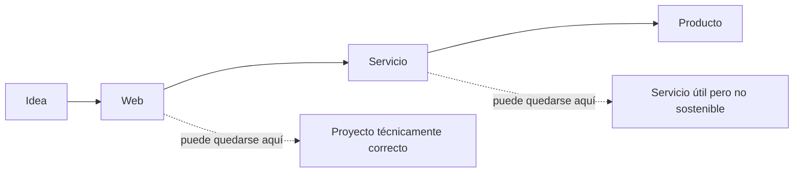
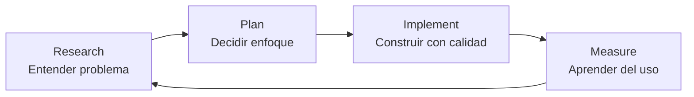

# De escribir código

# a construir producto

## Por qué desarrollar más no siempre es avanzar

José María Santos  
Tech Lead

<!--
Notas del ponente:
Abrir con calma, sin vender humo. La idea principal es sencilla: muchas veces confundimos construir software con avanzar. Esta charla va de cambiar esa mirada.

Mensaje clave:
No vengo a decir que el código no importe. Vengo a decir que el código importa más cuando sabemos para qué lo estamos escribiendo.
-->

---
layout: statement
---

# Un producto técnicamente impecable

# que nadie necesita sigue siendo

# algo que nadie necesita.

<!--
Notas del ponente:
Dejar unos segundos de silencio tras la frase. Es la tesis emocional de la charla.

Puedes decir:
Esta frase duele un poco, sobre todo a quienes disfrutamos construyendo. Pero es bastante sana. Porque nos recuerda que la calidad técnica no compensa la falta de valor.
-->

---
layout: default
---

# El problema no es desarrollar.

## El problema es confundir desarrollo con avance.

- Más funcionalidades ≠ más valor.
- Más arquitectura ≠ más futuro.
- Más automatización ≠ más foco.
- Más IA ≠ mejor criterio.

<!--
Notas del ponente:
Aquí no ataques el desarrollo. Tú eres técnico y esta charla debe sonar desde dentro, no como discurso de producto contra ingeniería.

Idea:
Construir es necesario. Pero construir sin aprender puede convertirse en una forma muy cara de evitar tomar decisiones.
-->

---
layout: cover
background: /images/progreso-visible.png
class: text-right
---

# La trampa del progreso visible

## Desarrollar se ve.

Medir, escuchar, borrar, decidir y renunciar se ve mucho menos.

Por eso muchas veces premiamos lo que parece avance, aunque no reduzca ninguna incertidumbre importante.

<!--
Notas del ponente:
Puedes usar ejemplos:
- Hemos montado autenticación.
- Hemos añadido filtros.
- Hemos creado un dashboard.
- Hemos metido una cola, caché, analítica, tests E2E, IA, notificaciones.

Y luego lanzar la pregunta:
¿Y estamos más cerca de resolver un problema real o solo tenemos una aplicación más sofisticada?
-->

---
layout: section
---

# 1 · Una web no es un producto

## Construir algo no demuestra todavía que alguien lo necesite.

---
layout: default
---

# Tres cosas que conviene separar

## Web

Algo que has construido y funciona técnicamente.

## Servicio

Algo que usan personas, aunque no necesariamente de forma recurrente.

## Producto

Algo que resuelve un problema con suficiente valor como para que alguien vuelva, dependa de ello o esté dispuesto a pagar.

<!--
Notas del ponente:
Este es uno de los bloques más importantes. Ir despacio.

Explicar que muchas veces llamamos producto a cualquier cosa con dominio, login y cuatro pantallas. Pero eso solo demuestra que sabemos construir software.

Matiz importante:
Un producto no tiene por qué ser de pago desde el primer día, pero sí debe tener una hipótesis clara de valor.
-->

---
layout: default
---

# Una web responde a una pregunta técnica

¿Soy capaz de construir esto?

# Un producto responde a otra

¿Tiene esto suficiente valor para alguien?

<!--
Notas del ponente:
Aquí puedes decir algo como:
La primera pregunta suele ser cómoda para perfiles técnicos. La segunda es más incómoda, porque el compilador no nos puede ayudar.

Remate:
El problema es que podemos pasar meses respondiendo muy bien a la pregunta equivocada.
-->

---
layout: default
---

# La evolución no es automática

<!--
Notas del ponente:
La flecha de web a servicio y de servicio a producto no es automática.

Una web puede estar muy bien hecha y no tener usuarios.
Un servicio puede ser útil para algunas personas, pero no justificar más inversión.
Un producto necesita recurrencia, valor, adopción o disposición de pago.

No dramatizar: quedarse en servicio no es un fracaso. El problema es no verlo.
-->

---
layout: section
---

# 2 · El espejismo de seguir construyendo

## Cuando no sabemos qué hacer, solemos hacer más de lo que ya dominamos.

---
layout: default
---

# Cuando algo no despega,

# hacemos lo que sabemos hacer

## Construir más.

- Otra funcionalidad.
- Otro rediseño.
- Otra integración.
- Otro refactor.
- Otro prompt.
- Otro agente.
- Otro dashboard.

<!--
Notas del ponente:
Aquí puedes meter humor seco:
Cuando eres técnico, cualquier problema empieza pareciendo una issue de Jira. Incluso cuando el problema no es técnico.

La idea es que construir más nos da sensación de control, porque es el terreno que conocemos.
-->

---
layout: two-cols-header
---

# Hay preguntas que no se contestan programando

::left::

- ¿Quién tiene realmente este problema?
- ¿Con qué frecuencia lo sufre?
- ¿Qué hace ahora para resolverlo?
- ¿Qué le costaría cambiar?
- ¿Qué tendría que ocurrir para que pagara?
- ¿Qué parte del sistema genera valor y cuál solo decora?

::right::

<!--
Notas del ponente:
Insistir en que estas preguntas son incómodas pero necesarias.

No hace falta convertirnos en Product Managers, pero sí necesitamos criterio de producto para no usar la ingeniería como anestesia.
-->

---
layout: cover
background: /images/feature-peligrosa.png
---

# La feature más peligrosa

La que construimos para evitar una conversación incómoda.

<!--
Notas del ponente:
De nuevo, pausa.

Ejemplos:
- Añadimos más opciones porque no sabemos para quién estamos diseñando.
- Creamos configuración avanzada porque no queremos elegir un flujo principal.
- Automatizamos algo que todavía no sabemos si merece ser automatizado.
- Metemos IA antes de entender el proceso manual.

Remate:
A veces una feature no es una solución. Es una forma elegante de aplazar una decisión.
-->

---
layout: section
---

# 3 · Cuando aparecen usuarios, cambia el juego

## El juguete técnico empieza a tener consecuencias.

---
layout: default
---

# Tener usuarios no lo convierte en producto

## Pero sí cambia tus responsabilidades.

- Ya no solo construyes.
- Ahora mantienes.
- Das soporte.
- Corriges expectativas.
- Mides comportamiento real.
- Priorizas con restricciones.
- Decides qué no merece la pena tocar.

<!--
Notas del ponente:
Este bloque conecta con tu experiencia: proyectos propios que llegaron a ser pequeños servicios.

Idea:
El usuario convierte el juguete técnico en algo que tiene consecuencias. Aunque sean pocas personas, ya hay alguien esperando que funcione.
-->

---
layout: two-cols-header
---

# El usuario rompe nuestras fantasías

::left::

## Usa el sistema como necesita, no como nosotros imaginamos.

Lo que tú considerabas secundario puede ser crítico.  
Lo que tú querías enseñar puede no importarle a nadie.  
Lo que tú pensabas que estaba claro puede ser invisible.

::right::

<!--
Notas del ponente:
Buen momento para una historia concreta.

Puedes contar un caso genérico de proyecto propio:
Construyes una funcionalidad pensando que es el centro del producto, pero al observar el uso descubres que la gente entra por otra cosa, usa otra ruta o directamente no entiende tu propuesta.

No inventar métricas. Hablar desde experiencia cualitativa.
-->

---
layout: two-cols-header
---

# La analítica no sirve para decorar dashboards

::left::

## Sirve para tomar decisiones incómodas.

- Qué se usa.
- Qué no se usa.
- Dónde se abandona.
- Qué genera recurrencia.
- Qué solo alimenta nuestro ego técnico.

::right::

<!--
Notas del ponente:
Aquí puedes mencionar que medir no es poner GA4, PostHog o cualquier herramienta y ya está.

La analítica útil empieza antes:
¿Qué necesito aprender?
¿Qué evento demostraría valor?
¿Qué señal me diría que debo parar?

Remate:
Un dashboard que no cambia decisiones es un salvapantallas caro.
-->

---
layout: section
---

# 4 · Aprender a no construir

## La decisión más madura no siempre añade código.

---
layout: two-cols-header
---

# La madurez técnica también consiste en frenar

::left::

No todo problema necesita código nuevo.

A veces necesitas:

- Hablar con usuarios.
- Reducir alcance.
- Borrar funcionalidad.
- Hacer una prueba manual.
- Medir antes de escalar.
- Decidir que no compensa.

::right::

<!--
Notas del ponente:
Este bloque debe sonar muy de Tech Lead.

Decir:
Como perfiles técnicos solemos defender la calidad construyendo mejor. Pero también defendemos la calidad evitando construir complejidad innecesaria.
-->

---
layout: default
---

# Antes de desarrollar, pregunta

¿Qué incertidumbre reduce esta funcionalidad?

Si no reduce ninguna incertidumbre importante, quizá solo estamos añadiendo superficie de mantenimiento.

<!--
Notas del ponente:
Esta puede ser una de las ideas para repetir durante la charla.

Ejemplos:
- Si no sabemos si hay demanda, un panel avanzado no reduce incertidumbre.
- Si no sabemos si entienden el flujo, una integración externa no reduce incertidumbre.
- Si no sabemos si volverán, una arquitectura más compleja no reduce incertidumbre.

Matiz:
Hay deuda técnica real que sí hay que abordar. Pero incluso ahí deberíamos explicar qué riesgo reduce.
-->

---
layout: two-cols-header
---

# Experimentos baratos,

# aprendizaje rápido

::left::

Antes de construir la versión “buena”, prueba la versión que aprende más rápido.

- Landing antes que plataforma completa.
- Proceso manual antes que automatización.
- Prototipo antes que arquitectura definitiva.
- Beta cerrada antes que lanzamiento público.
- Métrica concreta antes que dashboard universal.

::right::

<!--
Notas del ponente:
No vender esto como metodología mágica. Simplemente como higiene.

Frase posible:
No todo MVP tiene que dar vergüenza, pero sí debería impedirte gastar seis meses en validar una suposición que podías validar en una semana.

Evitar prometer tiempos concretos si lo usas como frase cerrada; mejor mantenerlo conceptual.
-->

---
layout: cover
background: /images/coste-feature.png
---

# El coste oculto de una feature

No es solo hacerla.

Es mantenerla, probarla, documentarla, migrarla, explicarla, rediseñarla, soportarla y cargarla en la cabeza cada vez que tomas una decisión.

<!--
Notas del ponente:
Aquí puedes conectar con testing y arquitectura.

Cada feature aumenta:
- Superficie de bugs.
- Casos de test.
- Complejidad de UX.
- Coste de refactor.
- Riesgo de regresión.

Remate:
La funcionalidad que nadie usa no es gratis. Es un okupa en tu base de código.
-->

---
layout: section
---

# 5 · Saber cerrar también es ingeniería

## No todo aprendizaje tiene que convertirse en producto.

---
layout: two-cols-header
---

# Cerrar no siempre es fracasar

::left::

A veces es reconocer que algo ya te ha dado el aprendizaje que podía darte.

Y que seguir invirtiendo no es constancia.  
Es apego con repositorio.

::right::

<!--
Notas del ponente:
Este es el cierre más personal. Puedes hablar de QueVeoAhora o de otro proyecto propio sin entrar en detalles privados si no quieres.

Idea:
Un proyecto puede pasar de web a servicio. Puede tener usuarios. Puede ser útil. Y aun así no tener suficiente recorrido como producto.
-->

---
layout: default
---

# Señales de que quizá toca parar

- Cada mejora exige más energía de la que devuelve.
- Los usuarios existen, pero no hay recurrencia suficiente.
- El valor percibido no justifica el coste de mantenimiento.
- Estás construyendo para mantener viva la idea, no para validar el producto.
- El coste de oportunidad empieza a ser evidente.

<!--
Notas del ponente:
No presentarlo como lista cerrada. Presentarlo como señales.

Puedes decir:
No hay una métrica universal para cerrar un proyecto. Pero sí hay momentos en los que, si eres honesto, sabes que estás empujando más por orgullo que por evidencia.
-->

---
layout: default
---

# Decidir no seguir también es una decisión técnica

Porque protege:

- Tu tiempo.
- Tu foco.
- Tu energía.
- La calidad de lo que sí merece inversión.
- Tu capacidad de aprender en el siguiente intento.

<!--
Notas del ponente:
Aquí darle dignidad al cierre.

Frase posible:
No todo proyecto tiene que acabar en producto. Algunos proyectos cumplen su función enseñándote qué no merece la pena construir.
-->

---
layout: section
---

# 6 · Qué cambia cuando piensas como producto

## El criterio de producto no reemplaza a la ingeniería: le da dirección.

---
layout: two-cols-header
---

# Cambia la forma de priorizar

::left::

Antes:

> ¿Qué podemos construir?

Después:

> ¿Qué necesitamos aprender o mejorar ahora?

::right::

  
<small style="display:block; color:#cbd5e1">ANTES</small><strong style="display:block; margin:.35rem 0; font-size:1.55rem">Más cosas</strong><small style="color:#cbd5e1">features · backlog · entrega</small>

  
↓

  
<small style="display:block; color:#fed7aa">DESPUÉS</small><strong style="display:block; margin:.35rem 0; font-size:1.55rem">Más criterio</strong><small style="color:#fed7aa">aprendizaje · impacto · riesgo</small>

<!--
Notas del ponente:
Este bloque sirve para aterrizar la charla en práctica profesional, no solo en side projects.

En empresa también pasa:
- Roadmaps llenos de funcionalidades.
- Migraciones sin criterios de adopción.
- Refactors sin explicación de riesgo.
- Automatizaciones sin impacto medible.

La mentalidad de producto no es solo para startups.
-->

---
layout: default
---

# Cambia la conversación técnica

Ya no defiendes una solución solo porque sea limpia.

La defiendes porque reduce riesgo, mejora adopción, facilita mantenimiento o aumenta la capacidad del equipo para entregar valor.

<!--
Notas del ponente:
Aquí conecta con liderazgo técnico.

Un Tech Lead no debería limitarse a decir “esto está mal hecho”. Debe explicar el impacto:
- Esto nos ralentiza.
- Esto nos impide medir.
- Esto nos bloquea al escalar.
- Esto va a multiplicar bugs.
- Esto no merece el coste ahora.
-->

---
layout: two-cols-header
---

# Cambia tu relación con la IA

::left::

La IA puede acelerar mucho la implementación.

Pero también puede acelerar una mala decisión.

::right::

<!--
Notas del ponente:
Meter aquí tu visión de IA con criterio.

Puedes decir:
Usar IA para construir más rápido está bien. Pero antes hay que decidir qué merece la pena construir. Si no, solo estamos poniendo turbo a una dirección equivocada.

Conectar con Research, Plan, Implement:
- Research para entender.
- Plan para decidir.
- Implement para construir.

La IA ayuda en las tres fases, pero no sustituye el criterio.
-->

---
layout: default
---

# Research → Plan → Implement → Measure

<!--
Notas del ponente:
Esta slide aterriza el ciclo.

Research:
- Usuarios.
- Contexto.
- Alternativas.
- Problema real.

Plan:
- Alcance.
- Riesgos.
- Métricas.
- Decisiones explícitas.

Implement:
- Código.
- Tests.
- Observabilidad.
- Entrega.

Measure:
- Uso real.
- Feedback.
- Decisiones nuevas.
-->

---
layout: section
---

# 7 · Cierre

## Construir bien también es saber qué no construir.

---
layout: statement
---

# La pregunta no es

# “¿qué más podemos desarrollar?”

# La pregunta es

# “¿qué decisión estamos evitando?”

<!--
Notas del ponente:
Esta es una de las frases finales fuertes.

No correr. Que quede clara.
-->

---
layout: default
---

# Ideas para llevarse

- Una web que funciona no es necesariamente un producto.
- Tener usuarios cambia tus responsabilidades; no garantiza sostenibilidad.
- Desarrollar más puede aplazar una decisión.
- La buena ingeniería también elimina, simplifica y frena.
- Cerrar puede ser una decisión madura.
- La IA acelera; el criterio sigue siendo humano.

<!--
Notas del ponente:
Resumen sin extenderse demasiado.

No leer la lista tal cual. Usarla como repaso.
-->

---
layout: end
---

# Gracias

## ¿Qué estás construyendo ahora mismo?

Y, sobre todo:

## ¿qué necesitas aprender antes de seguir construyendo?

José María Santos  
josemariasantos.com

<!--
Notas del ponente:
Cerrar con pregunta, no con moraleja excesiva.

Posible frase final:
Construir software es una habilidad poderosa. Precisamente por eso conviene usarla con criterio.
-->

